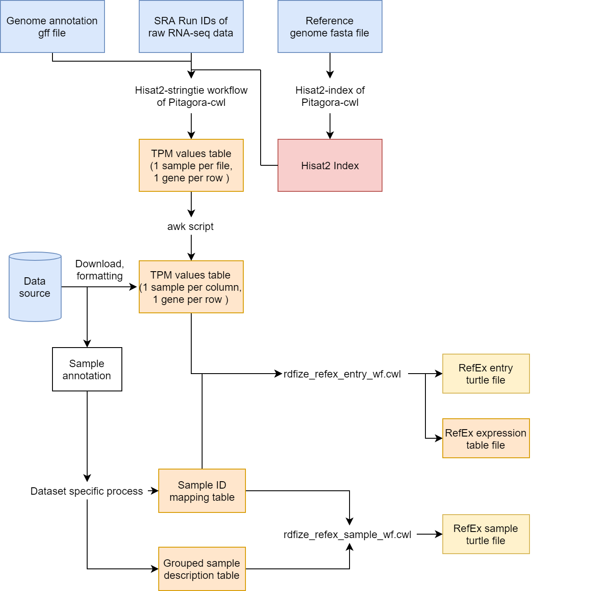

# RefEx Data Processing
This document outlines the steps involved in preparing gene expression data presented on RefEx.

You can find the CWL workflows and tools used for the procedures in the `cwl/` directory. The workflows output turtle format RDF files and tsv files.

Directories within the `project/` directory contain documents to describe data sources for each project and the specific formatting processes for each dataset. These directories also include yml files for the CWL workflows.

## Overview


## Raw sequence data processing
If calculated TPM value data was provided by a project, we used the calculated data for RefEx.

If TPM value data was not available, we calculated the TPM values from the raw sequence data with `HISAT2-StringTie` workflow of [Pitagora-cwl](https://github.com/pitagora-network/pitagora-cwl).  
The workflow requires a list of SRA Run IDs as an input and calculates TPM values for every individual sample and gene.  
The workflow also requires HISAT2 index files and a genome annotation file of the target species. The index files can be built from a genome sequence fasta file with the `HISAT2-index` tool of Pitagora-cwl.  
The output files of the workflow are formatted as a TPM table, whose format is described in the next section.

## Input table format

-   TPM table

    An input for `rdfize_refex_entry_wf.cwl`. This is a tsv file containing TPM expression values.  
    Each row name is a gene ID. Any kind of gene ID (e.g. Ensembl, entrez, etc.) is allowed.  
    Each column name is a BioSample ID. If technical replicates exist and BioSample IDs are not unique within the dataset, SRA Run IDs may be used instead.  
    Table values are TPM of a sample specified by the column name and a gene specified by the row name.  
    
    Example:
    
|             | SAMN07187967 | SAMN07187968 | SAMN07188034 |
|-------------|--------------|--------------|--------------|
| FBgn0265945 | 0.0          | 0.0          | 0.126749     |
| FBgn0265946 | 0.0          | 0.0          | 4.181805     |
| FBgn0265947 | 0.0          | 0.0          | 0.0          |
| FBgn0003187 | 3.695364     | 0.628946     | 0.981611     |

-   Grouped sample description table

    Input for `rdfize_refex_sample_wf.cwl`.

    In RefEx, replicated samples are grouped and statistical values of TPM are calculated for each group.  
    This tsv table describes the annotation of the groups.  
    The columns 1 through 3 are:  
    `RefexSampleId`: ID for each sample group, which has `RES` as the prefix.  
    `Description`: A human-readable description of a sample group.  
    `NumberOfSamples`: The number of samples which the sample group includes.  
    In columns 4 and after, any sample annotations can be described for each data set.  
    Example:
    
| RefexSampleId | Description                                                    | NumberOfSamples | Category | Strain | Tissue                                           | Sex    |
|---------------|----------------------------------------------------------------|-----------------|----------|--------|--------------------------------------------------|--------|
| RES00001615   | orgR, abdomen without digestive or reproductive system, female | 4               | tissues  | orgR   | abdomen without digestive or reproductive system | female |
| RES00001616   | orgR, abdomen without digestive or reproductive system, male   | 4               | tissues  | orgR   | abdomen without digestive or reproductive system | male   |
| RES00001617   | orgR, digestive plus excretory system, female                  | 4               | tissues  | orgR   | digestive plus excretory system                  | female |
| RES00001618   | orgR, digestive plus excretory system, male                    | 4               | tissues  | orgR   | digestive plus excretory system                  | male   |

-   Sample ID mapping table

    An input for both `rdfize_refex_entry_wf.cwl` and `rdfize_refex_sample_wf.cwl`.  
    This table contains BioSample IDs, IDs given by each project, and RES IDs of the sample group to which the sample belong.  
    Statistics of TPM values are calculated for sample groups defined by this table.
    
    Column 1: `RefexSampleId`  
    Column 2: `BiosampleId`  
    Column 3: `ProjectSampleId` ID given by each project.  
    
    Example:  
    (In this example Project sample IDs are GEO sample IDs)
    
| RefexSampleId | BiosampleId  | ProjectSampleId |
|---------------|--------------|-----------------|
| RES00001615   | SAMN07187968 | GSM2647254      |
| RES00001615   | SAMN07187967 | GSM2647255      |
| RES00001615   | SAMN07188041 | GSM2647256      |
| RES00001616   | SAMN07188040 | GSM2647257      |
| RES00001616   | SAMN07188039 | GSM2647258      |
| RES00001616   | SAMN07188038 | GSM2647259      |


## Outputs
Besides a turtle file, `rdfize_refex_entry_wf.cwl` outputs a tsv table file which contains statistical values calculated for each sample group.  
The statistical values are five-number summary (the minimum, the maximum, the median, and the first and third quartiles), the mean, and the standard deviation of TPM values and log2(TPM+1) values of samples in a sample group.  
Note that the mean value of the log-transformed values is calculated after log-transformation of raw TPM values (i.e., it is not the log-transformed mean value).

## Input yaml example

- `rdfize_refex_sample_wf.yml.sample`
```
eachsample_table_file:
  class: File
  path: /path/to/eachsample.tsv
sample_table_file:
  class: File
  path: /path/to/sample.tsv
id_uri_prefix: _URI_PREFIX_
id_uri_abbrev: _URI_ABBREV_
signature_file:
  class: File
  path: /path/to/signature.ttl
final_output_filename: refexsample_project_date.ttl
```
`eachsample_table_file` and `sample_table_file` are the path to the sample ID mapping table and the grouped sample description table, respectively.

`id_uri_prefix` is the prefix of project sample IDs' URI.  
e.g. `<http://fantom.gsc.riken.jp/5/sstar/FF:>`

`id_uri_abbrev` is the abbreviation of the prefix indicated by `id_uri_prefix`.  
e.g. `ff`

These will be output to the turtle as:  
```
@prefix ff:      <http://fantom.gsc.riken.jp/5/sstar/FF:> .
```
`signature_file` is the path to the turtle file which contains basic information of the RefEx RDF.  

`final_output_filename` is the name of the output turtle file.

- `rdfize_refex_entry_wf.yml.sample`
```
eachsample_table_file:
    class: File
    path: /path/to/eachsample.tsv
tpm_table_file:
    class: File
    path: /path/to/tpm.tsv
entry_id_num: _ID_TO_BEGIN_WITH_
entry_table_filename: project_refextable_entry.tsv
id_uri_prefix: _URI_PREFIX_
id_uri_abbrev: _URI_ABBREV_
signature_file:
    class: File
    path: /path/to/signature.ttl
concatenated_filename: refex_project_date.ttl
```
`eachsample_table_file` and `tpm_table_file` are the path to the sample ID mapping table and the tpm table, respectively.

`entry_id_num` is the number to be given to the first entry as its RFX ID.

`id_uri_prefix` is the prefix of gene IDs' URI.  
e.g. `<http://rdf.ebi.ac.uk/resource/ensembl/>`

`id_uri_abbrev` is abbreviation of the prefix indicated by `id_uri_prefix`.  
e.g. `ensembl`

These will be output in the turtle as:  
```
@prefix ensembl: <http://rdf.ebi.ac.uk/resource/ensembl/> .
```
`signature_file` is the path to the turtle file which contains basic information of the RefEx RDF.

`concatenated_filename` is the name of the output turtle file.

## Run

```
$ cwltool rdfize_refex_entry_wf.cwl rdfize_refex_entry_wf.yml
```
```
$ cwltool rdfize_refex_sample_wf.cwl rdfize_refex_sample_wf.yml
```
